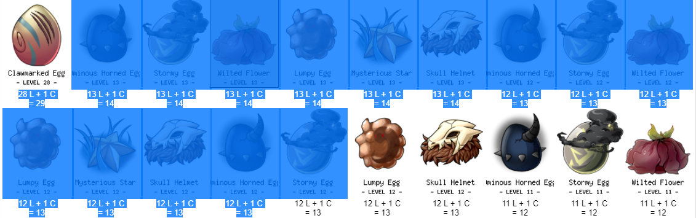

# cc-click-queue
This is a Chrome extension to simulate an adoptable queue for the Click Exchange on clickcritters.com. **This extension only works on Google Chrome.**
# Installation
1. Download all of these files by clicking **Clone or Download**, a green button near the top-right corner of the list of files. Choose "Download ZIP."
2. Unzip the folder into a new folder on your computer.
3. In Chrome, go to the top right and click on the 3-dots menu. Go to **More tools > Extensions**.
4. Enable **Developer Mode**, which is located in the top right corner.
5. Click on the **Load unpacked** button.
6. Select the folder you just created.
7. Make sure this extension is enabled.
8. For best experience, it is also recommended that you pin this extension to the browser toolbar.
# Usage
1. Click on the extension icon to open the pop-up menu.
2. Click on **Edit Queue**.
3. From a separate window, drag and drop the images of the adoptables you want to add to the queue. Images can be dragged one at a time, or multiple images can be selected at once by highlighting them.

4. On the queue page, enter the target level for these adoptables, and then click **Add to Queue**.
5. Click on **Start Queue**.
